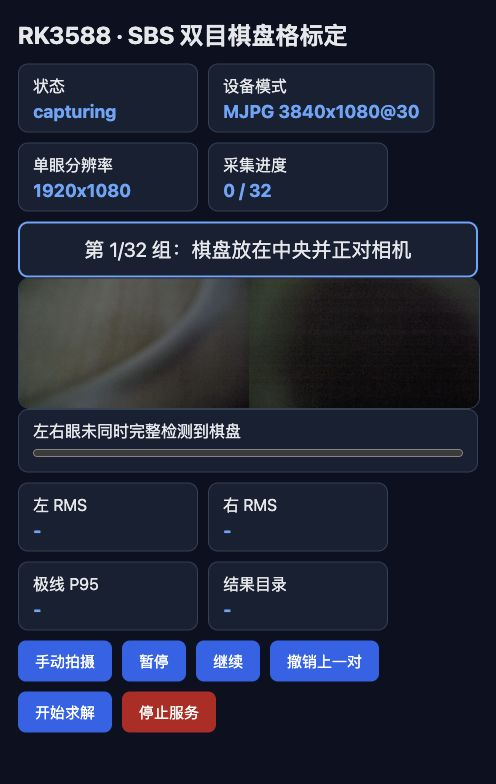

# stereo

面向单设备左右拼接（SBS）双目相机的棋盘格标定工具。支持 macOS 本地采集，以及 RK3588 上通过浏览器完成无界面引导采集；可输出 OpenCV/Python/C++ 使用的内参、畸变、双目外参和校正映射。

第一次使用请先阅读：[零基础使用手册](docs/零基础使用手册.md)。

## 当前硬件模式

- 相机：单路 UVC 双目相机，单帧包含左右画面
- RK3588 设备：`/dev/video0`
- 原生采集：MJPEG `3840×1080@30 FPS`
- 单眼分辨率：`1920×1080`
- 当前实测棋盘：`5×8` 内角点（6×9 个方格）
- 默认采集目标：32 组

标定时必须让左右眼同时看到完整棋盘。方格实际边长决定平移向量、基线和深度的物理尺度，必须用尺测量后传给 `--square-mm`。

## 安装与测试

```bash
python3 -m venv --system-site-packages .venv
.venv/bin/python -m pip install PyYAML pytest
.venv/bin/python -m pytest -q
```

## RK3588 浏览器采集

在 RK3588 上启动：

```bash
./calibrate \
  --web \
  --device /dev/video0 \
  --host 0.0.0.0 \
  --port 8765 \
  --square-mm 20
```

浏览器访问：

```text
http://<RK3588-IP>:8765/
```



页面显示设备模式、单眼分辨率、采集进度、下一组姿态提示、实时双目预览和操作按钮。

若浏览器不能直接访问局域网地址，可建立 SSH 隧道：

```bash
ssh -N -L 18765:127.0.0.1:8765 root@<RK3588-IP>
```

然后访问：

```text
http://127.0.0.1:18765/
```

### 手动引导顺序

页面按成功保存的数量给出下一组姿态：

1. 中央正对：2 组
2. 左、右、上、下：各 2 组
3. 左上、右上、左下、右下：各 2 组
4. 左右偏航、上下俯仰、顺逆时针旋转：各 2 组
5. 靠近、远离：各 1 组

每次点击“手动拍摄”会保存完整 SBS JPEG，以及左右眼 PNG。达到 32 组后停止继续排队。每次 Web 服务重新启动时，上一轮最新素材会完整复制到 `backups/<会话时间>/`，原始 `sessions/<会话时间>/` 不删除、不覆盖。

## 标定流程

合理的处理链路为：

```text
手动拍摄
  → 左右眼角点检测
  → 模糊/反光/越界初筛
  → 双目标定求解
  → 重投影与极线误差检查
  → 剔除几何异常样本
  → PASS 或指导补拍
  → 导出标定产物
```

“手动拍摄”只表示由操作者决定快门时机；标定仍必须检测左右眼棋盘内角点。建议至少保留 20 组有效样本。

## 输出文件

通过后写入：

```text
sessions/<会话时间>/results/<结果目录>/
```

| 文件 | 用途 |
|---|---|
| `stereo_calibration.yaml` | OpenCV/C++ 标定参数 |
| `stereo_calibration.json` | 跨语言参数及质量指标 |
| `stereo_calibration.npz` | Python/NumPy 标定参数 |
| `rectify_maps.yml.gz` | OpenCV/C++ 左右校正映射 |
| `rectify_maps.npz` | Python/NumPy 左右校正映射 |
| `quality_report.json` | RMS、极线误差、有效及剔除样本 |
| `rectification_preview.png` | 带水平极线的校正预览 |

### 参数字段

`stereo_calibration.yaml`、JSON 和 NPZ 中的主要字段：

| 标定量 | 字段 |
|---|---|
| K1 | `left_camera_matrix` |
| K2 | `right_camera_matrix` |
| D1 | `left_distortion` |
| D2 | `right_distortion` |
| R | `rotation` |
| T | `translation` |
| E | `essential` |
| F | `fundamental` |
| R1 | `rectification_left` |
| R2 | `rectification_right` |
| P1 | `projection_left` |
| P2 | `projection_right` |
| Q | `disparity_to_depth` |

当前使用 OpenCV pinhole 五参数畸变模型，顺序为 `k1, k2, p1, p2, k3`。相机参数 `fx, fy, cx, cy` 分别位于 K 矩阵的 `(0,0)`、`(1,1)`、`(0,2)`、`(1,2)`。基线为 `norm(T)`。

## C++ 读取示例

```bash
cmake -S examples/cpp -B examples/cpp/build
cmake --build examples/cpp/build

examples/cpp/build/load_calibration \
  sessions/<会话时间>/results/<结果目录>/stereo_calibration.yaml \
  sessions/<会话时间>/results/<结果目录>/rectify_maps.yml.gz \
  sessions/<会话时间>/manual/0000_sbs.jpg
```

## macOS 模式

枚举 AVFoundation 设备：

```bash
ffmpeg -f avfoundation -list_devices true -i "" 2>&1 | grep -E "\[[0-9]+\]"
```

启动本地采集：

```bash
./calibrate --device-index 0 --capture-width 3840 --capture-height 1080 --square-mm 20
```

如果相机无法打开，请在“系统设置 → 隐私与安全性 → 相机”中允许 Terminal 或 Codex 访问。

## 注意事项

- 标定分辨率必须与实际运行分辨率一致。
- 棋盘必须保持刚性和平整；不要使用弯曲纸张。
- 屏幕显示棋盘会受到缩放、反光和实际方格尺寸不确定的影响，仅适合快速验证。
- 未实测方格边长时，内参与校正可用于试验，但 T、基线和深度尺度不能视为最终值。
- Web 页面未实现认证，只应在可信局域网临时运行。
