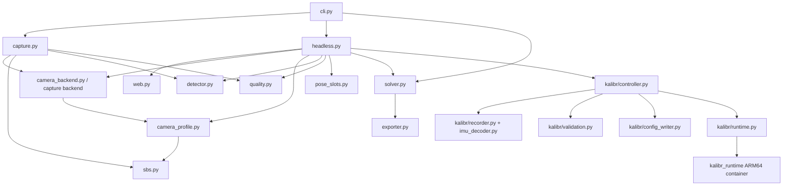
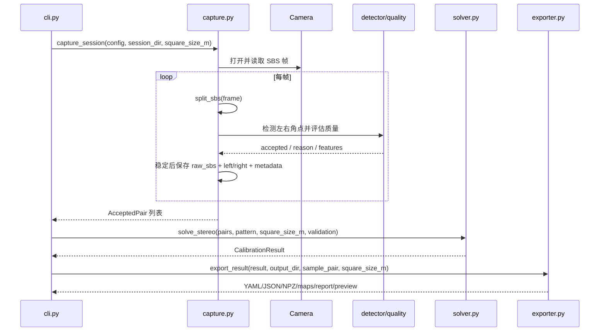
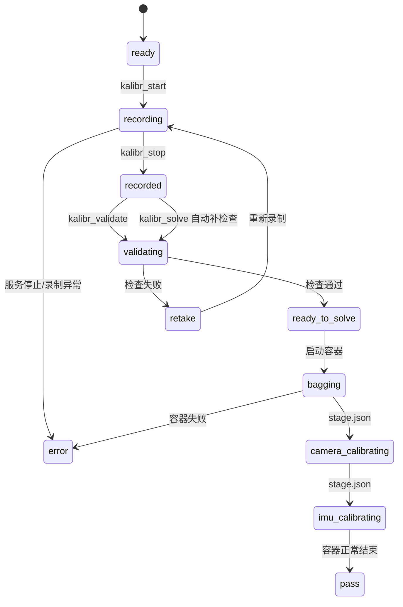

# 立体棋盘标定项目架构说明

> 本文是项目的架构总览，描述当前代码已经实现的边界和流程。具体安装、按钮操作和 Kalibr 运动要求请以文末的操作文档为准。

## 1. 项目定位与边界

本项目是一个面向单路 SBS（Side-by-Side）双目相机的标定工具。相机通过一个视频设备输出一帧左右拼接图像，例如 `3840×1080`，左、右眼各占一半；特殊的 World Intelligent 相机可能在左侧携带 IMU 码带，需要按相机 profile 裁剪。

项目当前负责：

- 识别并打开 macOS AVFoundation 或 Linux V4L2 相机；
- 将一帧 SBS 图像拆成左右眼图像；
- 检测棋盘角点，按清晰度、过曝、边缘留白和姿态新颖度筛选样本；
- 通过 OpenCV 完成双目相机标定、立体校正和质量验收；
- 在 RK3588 上提供浏览器控制的采集和 Kalibr Camera+IMU 联合标定流程；
- 导出供 Python、OpenCV/C++ 和后续工具使用的标定产物。

项目当前不负责：

- 生产环境中的立体匹配、视差计算或深度服务；
- 自动调用 `examples/cpp/load_calibration`；
- 把标定结果写入其他设备的生产数据库或 SDK；
- 在 RK3588 主机上直接安装完整 ROS/Kalibr 环境。Kalibr 通过 ARM64 Docker 容器运行。

## 2. 部署拓扑

```mermaid
flowchart LR
    U[操作者浏览器 / Mac] -->|HTTP 18765| T[SSH 隧道]
    T -->|HTTP 8765| W[RK3588 标定服务]
    W --> E[HeadlessCalibrationEngine]
    E --> V[/dev/video0]
    V --> C[World Intelligent 或普通 SBS 相机]
    E --> O[OpenCV Chessboard 分支]
    E --> K[KalibrController]
    K --> D[ARM64 Docker: Kalibr]
    E --> S[(sessions/<会话时间>)]
    D --> S
    S --> A[结果下载 / 人工检查]
```

### 2.1 运行位置

| 位置 | 当前职责 | 主要入口 |
|---|---|---|
| Mac 或开发机 | 本地采集、浏览器、SSH 隧道、手动查看结果 | `./calibrate`、`deploy/start.sh` |
| RK3588 主机 | 持有 `/dev/video0`、实时采帧、Web 控制、Session 持久化 | `./calibrate --web --device /dev/video0 ...` |
| 摄像头 | 输出单路 SBS 视频帧；特殊型号在画面中编码 IMU 数据 | V4L2 或 AVFoundation |
| ARM64 容器 | 生成 rosbag 并执行 Kalibr 相机/IMU 求解 | `KalibrRuntime` |

`deploy/start.sh` 负责检查 SSH、启动或复用 RK3588 服务、检查 Kalibr 镜像，并建立 `127.0.0.1:18765 -> RK3588:8765` 隧道。它是部署辅助脚本，不是标定算法层。

## 3. 代码分层与模块职责



| 层 / 文件 | 职责 | 不应承担的职责 |
|---|---|---|
| `cli.py` | 参数解析、配置覆盖、选择本地或 Web 入口、创建 Session | 不实现角点检测或矩阵求解 |
| `camera_backend.py` | Linux V4L2 模式探测和打开摄像头 | 不决定标定质量 |
| `capture.py` | macOS 本地采集循环和保存有效样本 | 不负责 Web API |
| `camera_profile.py` | 识别普通 SBS / World Intelligent profile，并按 profile 拆帧 | 不执行 Kalibr 求解 |
| `sbs.py` | 普通 SBS 中线拆分和左右眼交换 | 不做标定参数计算 |
| `detector.py` | 棋盘内角点检测和姿态特征提取 | 不决定最终 PASS |
| `quality.py` | 对当前样本做清晰度、过曝、边缘和新颖度判断 | 不替代最终几何验收 |
| `pose_slots.py` | RK3588 手动采集的姿态槽位分类 | 不保存标定矩阵 |
| `headless.py` | RK3588 相机线程、状态、预览、OpenCV 求解触发和 Kalibr 转发 | 不提供 HTTP 路由实现 |
| `web.py` | 静态页面、状态接口、MJPEG 流和 action 转发 | 不直接读写相机帧 |
| `solver.py` | 单目内参、双目 R/T、E/F、校正矩阵和映射生成 | 不负责操作员交互 |
| `exporter.py` | 写 YAML/JSON/NPZ、校正映射、质量报告和预览 | 不决定采集样本 |
| `kalibr/*` | IMU 码带解码、录制、校验、配置生成、Docker 求解和状态恢复 | 不参与普通 OpenCV 求解 |
| `examples/cpp/` | 独立 C++ 读取/校正验证示例 | 不属于 Python 主流程 |

## 4. 入口与调用关系

### 4.1 CLI 入口

仓库根目录的 `calibrate` 启动 Python 包的 CLI。`cli.py` 读取 `configs/default.yaml`，再应用命令行参数，创建：

- 本地模式：`capture_session(...) -> solve_stereo(...) -> export_result(...)`；
- Web 模式：`HeadlessCalibrationEngine.start()` + `create_server(...)`。

`--dry-run` 只打印解析后的配置，不打开相机，也不创建 Session。

### 4.2 本地 OpenCV 采集入口



采集不足 `minimum_pairs` 时直接返回 RETAKE；求解后由 RMS、极线误差和异常样本比例决定 `final` 或 `diagnostic` 结果目录。

### 4.3 RK3588 Web 入口

Web 模式中，`HeadlessCalibrationEngine` 是共享状态的所有者：相机线程更新状态和预览，HTTP handler 只读取快照或把 action 转发给引擎。

主要接口：

| 方法 | 路径 | 用途 |
|---|---|---|
| `GET` | `/` | 返回控制页面 |
| `GET` | `/api/status` | 返回 OpenCV 状态和 Kalibr 状态快照 |
| `GET` | `/api/artifacts` | 返回可下载产物映射 |
| `GET` | `/artifact/<key>` | 下载白名单中的产物 |
| `GET` | `/stream.mjpg` | 输出当前预览帧 |
| `POST` | `/api/action` | 执行 pause/resume/solve/mode/kalibr 等动作 |

`web.py` 不直接执行标定算法。它通过 `engine.status_snapshot()`、`engine.latest_preview()` 和 `engine.action(name)` 与引擎交互。

## 5. OpenCV Chessboard 工作流

### 5.1 帧到样本

1. 相机后端打开视频设备并确认实际模式。
2. `camera_profile.py` 判断是否为特殊码带相机；普通 SBS 使用 `sbs.py` 中线拆分，特殊相机按 profile 固定区间裁剪。
3. 左右图转灰度后由 `detector.py` 查找棋盘角点。
4. `quality.py` 检查两眼均检测成功、清晰度、裁剪/过曝比例、边缘留白和姿态新颖度。
5. 样本满足条件并保持稳定 `stable_seconds` 后保存。

### 5.2 求解与验收

`solver.py` 以棋盘实际方格尺寸生成 3D 点，先做左右单目标定，再做双目标定和立体校正，输出：

`K1/D1 + K2/D2 -> R/T/E/F -> R1/R2/P1/P2/Q -> left/right rectify maps`

默认验收门槛来自 `configs/default.yaml`：

| 指标 | 默认值 |
|---|---:|
| 目标样本数 | 32 对 |
| 最少样本数 | 20 对 |
| 单目 RMS 上限 | 0.7 px |
| 极线误差中位数上限 | 0.35 px |
| 极线误差 P95 上限 | 1.0 px |
| 最大异常样本比例 | 20% |

失败时仍保留 Session 和诊断结果，便于复盘；成功结果目录名为 `final`，未通过目录名为 `diagnostic`。

## 6. Kalibr Camera+IMU 工作流

该流程只适用于检测到可用 IMU 码带的相机，并与普通 OpenCV Chessboard 求解分开管理。



### 6.1 录制阶段

`KalibrController` 创建 `KalibrRecorder`，由 `HeadlessCalibrationEngine._run()` 在采帧时调用 `ingest(raw_frame, left, right, frame_idx)`。录制器：

- 通过 `imu_decoder.py` 解码码带中的 IMU 样本；
- 按 `image_stride` 抽取左右灰度图到 `kalibr/cam0` 和 `kalibr/cam1`；
- 写入 `imu0.csv`、`frames.csv`、`capture.json` 和 `decoder_stats.json`；
- 维护解码比例、时间戳单调性、图像数和 IMU 样本数。

### 6.2 校验和容器求解

停止录制后，`validate_dataset()` 按时长、解码比例、IMU 频率和棋盘覆盖度检查数据；通过后 `config_writer.py` 生成 `target.yaml`、`imu.yaml` 和 `pipeline.json`。`KalibrRuntime` 使用固定镜像、只读容器、无网络和 Session 目录挂载启动容器。

控制器通过 `stage.json` 和 Docker 状态轮询阶段，结果通常包括：

`results/dataset.bag`、`camchain.yaml`、`camchain-imucam.yaml`、相机/IMU PDF 报告、日志、`summary.json`。

默认 Kalibr 门槛：录制至少 60 秒，建议 90 秒；解码比例至少 90%；IMU 采样率范围 250–400 Hz。

## 7. Session 与产物契约

### 7.1 OpenCV Session

```text
sessions/<YYYYMMDD_HHMMSS>/
├── session.yaml
├── raw_sbs/                  # 原始 SBS 帧
├── accepted/                 # 有效左右图和 metadata
├── manual/                   # Web 手动拍摄素材（如有）
└── results/
    ├── final/                # 通过验收
    └── diagnostic/           # 未通过验收但保留诊断
```

结果文件：

| 文件 | 消费者 | 说明 |
|---|---|---|
| `stereo_calibration.yaml` | OpenCV/C++ | 标定矩阵、图像尺寸、质量指标 |
| `stereo_calibration.json` | 跨语言工具 | 显式矩阵行列和质量摘要 |
| `stereo_calibration.npz` | Python/NumPy | 数值矩阵 |
| `rectify_maps.yml.gz` | OpenCV/C++ | 左右 `remap` 映射 |
| `rectify_maps.npz` | Python/NumPy | NumPy 映射 |
| `quality_report.json` | 人工/自动检查 | RMS、极线误差和异常原因 |
| `rectification_preview.png` | 人工检查 | 带水平线的校正预览 |

### 7.2 Kalibr Session

```text
sessions/<YYYYMMDD_HHMMSS>/kalibr/
├── cam0/
├── cam1/
├── imu0.csv
├── frames.csv
├── capture.json
├── decoder_stats.json
├── validation.json
├── job.json
├── target.yaml / imu.yaml / pipeline.json
└── results/
    ├── dataset.bag
    ├── camchain*.yaml
    ├── *report*.pdf
    └── *.log / summary.json
```

`job.json` 是 Kalibr 控制器的可恢复状态；`stage.json` 是容器流水线向主机报告当前阶段的边界文件。

## 8. 状态、动作与失败边界

### 8.1 OpenCV 引擎状态

常见状态为 `starting`、`capturing`、`paused`、`solving`、`pass`、`retake`、`error`、`stopped`。`solve` 只有在已保存样本达到最少数量后才会被接受；求解期间不能撤销或切换工作流。

### 8.2 Kalibr 状态

常见状态为 `ready`、`recording`、`recorded`、`validating`、`ready_to_solve`、`bagging`、`camera_calibrating`、`imu_calibrating`、`pass`、`retake`、`error`。录制、校验或容器求解期间禁止切换工作流。

出现相机读取失败、帧尺寸变化、磁盘写入失败、数据校验失败或容器异常时，系统保留当前 Session，并通过状态快照或 `error` 字段暴露原因；重新录制 Kalibr 数据时，旧 `kalibr/` 目录会被移动为带时间戳的备份目录。

## 9. C++ 示例的边界

`examples/cpp/load_calibration.cpp` 是一个独立的 OpenCV C++ 示例：读取 `stereo_calibration.yaml` 和 `rectify_maps.yml.gz`，读取一张 SBS 图片，切分、校正并输出 `rectified_cpp.png`。

它的真实关系是：

```text
exporter.py  ──写出──> stereo_calibration.yaml + rectify_maps.yml.gz
                                     │
                                     └──手动传参──> load_calibration
```

它不会被 `cli.py`、`headless.py`、`web.py` 或 `exporter.py` 自动调用。只有 `examples/cpp/CMakeLists.txt` 构建它，README 中的命令负责人工运行它。因此修改 C++ 示例不会改变标定服务的主流程；修改 YAML/map 产物契约则会同时影响 Python 导出器和 C++ 示例。

## 10. 变更影响指南

| 修改位置 | 需要联查 |
|---|---|
| `camera_backend.py` / `camera_profile.py` / `sbs.py` | 设备模式、左右眼布局、OpenCV 与 Kalibr 两条输入链 |
| `detector.py` / `quality.py` / `pose_slots.py` | 样本接收率、姿态覆盖、最终求解数据量 |
| `solver.py` / `exporter.py` | `final/diagnostic` 结论、所有标定格式、C++ 读取示例 |
| `headless.py` / `web.py` | Web API、状态机、浏览器控制和部署脚本 |
| `kalibr/recorder.py` / `imu_decoder.py` | IMU 解码、时间戳、Kalibr 数据集质量 |
| `kalibr/controller.py` / `runtime.py` | 校验、容器生命周期、恢复和结果下载 |
| `configs/default.yaml` | 采集数量、质量门槛、Kalibr 校验门槛；必须同步检查操作文档 |
| `deploy/start.sh` | RK3588 启动、SSH 隧道、端口和远端路径 |

## 11. 相关文档

- [项目 README](../README.md)：安装、启动和 C++ 示例命令。
- [标定工程功能介绍](标定工程功能介绍.md)：输出字段、工程定位和组件职责的操作级说明。
- [标定工程零基础实用手册](标定工程零基础实用手册.md)：面向操作员的完整使用说明。
- [Kalibr 联合标定操作指导](Kalibr联合标定操作指导.md)：Kalibr 的运动方式、按钮步骤和量化验收。
- [RK3588 Kalibr 运行环境](../kalibr_runtime/README.md)：ARM64 容器构建和运行环境说明。

## 12. 当前架构的核心控制点

如果需要控制整体流程，优先关注以下四个边界：

1. **相机 profile 边界**：决定一帧如何变成左右眼图像，以及 IMU 码带是否可用。
2. **Session 边界**：所有可复盘素材、状态和产物都必须归属于一个会话目录。
3. **工作流边界**：OpenCV Chessboard 和 Kalibr Camera+IMU 共享相机线程和 Web 控制面，但使用不同的数据验收与求解链。
4. **产物边界**：`exporter.py` 的 OpenCV 文件和 Kalibr `results/` 是下游消费接口；C++ 示例只消费前者，不反向参与生成。
